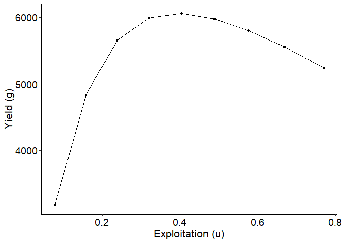
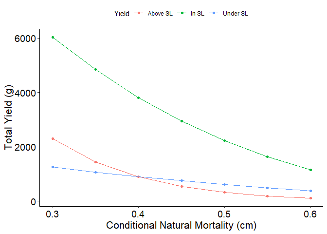
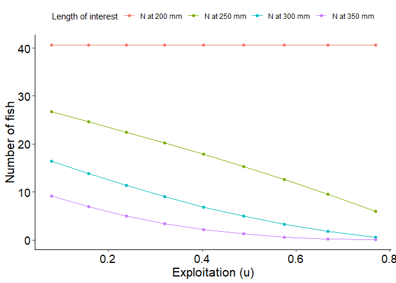

<!-- README.md is generated from README.Rmd. Please edit that file -->

## rFAMS

<!-- badges: start -->

<!-- badges: end -->

### Fisheries Analysis and Modeling Simulator in R

Simulates the dynamics of exploited fish populations using the Jones
modification of the Beverton-Holt equilibrium yield equation to compute
yield-per-recruit and dynamic pool models (Ricker 1975)
<https://publications.gc.ca/site/eng/480738/publication.html>. Allows
users to evaluate minimum, slot, and inverted length limits on exploited
fisheries using specified life history parameters. Users can simulate
population under a variety of conditional fishing mortality and
conditional natural mortality. Calculated quantities include number of
fish harvested and dying naturally, mean weight and length of fish
harvested, number of fish that reach specified lengths of interest,
total number of fish and biomass in the population, and stock density
indices.

This package is maintained by [Jason Doll](mailto:jcdoll20@hotmail.com),
Associate Professor of Fisheries at Francis Marion University

### Support

This project is supported in part by the American Fisheries Society Data
and Technology Section (<https://units.fisheries.org/fits/>)

### Status

The package currently replicates all yield per recruit and dynamic pool
modeling in FAMS with the exception of spawning potential ratio.
Spawning potential ratio calculations will be added at a later date.
Life history parameters can be estimated using FSA.

#### Equilibrium Modeling

1.  Initial package development completed
2.  Add spawning potential ratio
3.  Incorporate suggestions from the fisheries community.

#### Dynamic Pool Modeling

1.  Complete
2.  Add spawning potential ratio
3.  Incorporate suggestions from the fisheries community.

#### RShiny Development

1.  Initial development completed
2.  Test with CRAN released rFAMS v0.0.1

### Installation

The [most recent stable
version](https://cloud.r-project.org/package=rFAMS) from CRAN may be
installed with

``` r
install.packages("rFAMS")
```

The [development version](https://github.com/fishR-Core-Team/rFAMS) may
be installed from GitHub with

``` r
# install.packages("devtools")
devtools::install_github("fishR-Core-Team/rFAMS")
```

You may need R Tools installed on your system to install the development
version from GitHub. See the instructions for ([R Tools for
Windows](https://cran.r-project.org/bin/windows/Rtools/) or [R Tools for
Mac OS X](https://cran.r-project.org/bin/macosx/tools/)).

 

#### Questions / Comments / Problems or Contributions

Report questions, comments, or bug reports on the [issues
page](https://github.com/fishR-Core-Team/rFAMS/issues).

Please adhere to the [Code of
Conduct](https://fishr-core-team.github.io/rFAMS/CODE_OF_CONDUCT.html).

### Example

This is a basic example which shows you how simulate yield based on a
single minimum length limit with variable cf and variable cm:

``` r
#Load other required packages for organizing output and plotting
library(rFAMS)
#> ## rFAMS v0.0.2. See citation('rFAMS') if used in publication.
#> ## Visit https://github.com/fishR-Core-Team/rFAMS/issues to report any bugs.
library(tidyr)    ## for pivot_longer
library(dplyr)    ## for filter
#> 
#> Attaching package: 'dplyr'
#> The following objects are masked from 'package:stats':
#> 
#>     filter, lag
#> The following objects are masked from 'package:base':
#> 
#>     intersect, setdiff, setequal, union
library(ggplot2)  ## for ggplot et al.

# Life history parameters to be used below
LH <- makeLH(N0=100,tmax=15,Linf=592,K=0.20,t0=-0.3,LWalpha=-5.528,LWbeta=3.273)

# Estimate yield for one minLL and multiple cf and cm values.
#  This is a minimal example, lengthinc, cfinc, cminc would likely be smaller
#  to produce finer-scaled results
Res_1 <- yprBH_minLL_fixed(minLL=200,
                          cfmin=0.1,cfmax=0.9,cfinc=0.1,
                          cmmin=0.1,cmmax=0.9,cminc=0.1,
                          loi=c(200,250,300,350),lhparms=LH)

# Custom theme for plots (to make look nice)
theme_FAMS <- function(...) {
 theme_bw() +
 theme(
   panel.grid.major=element_blank(),panel.grid.minor=element_blank(),
   axis.text=element_text(size=14,color="black"),
   axis.title=element_text(size=16,color="black"),
   axis.title.y=element_text(angle=90),
   axis.line=element_line(color="black"),
   panel.border=element_blank()
 )
}

# Yield curve (yield vs exploitation)
# Extract results for cm=0.40
plot_dat <- Res_1 |> dplyr::filter(cm==0.40)

ggplot(data=plot_dat,mapping=aes(x=u,y=yield)) +
 geom_point() +
 geom_line() +
 labs(y="Yield (g)",x="Exploitation (u)") +
 theme_FAMS()
```



``` r

 #Plot number of fish reaching 300 mm as a function of exploitation with cm = 0.40
ggplot(data=plot_dat,mapping=aes(x=u,y=`N at 300 mm`)) +
 geom_point() +
 geom_line() +
 labs(y="Number of fish at 300 mm",x="Exploitation (u)") +
 theme_FAMS()
```



``` r
# Plot number of fish reaching 300 mm as a function of exploitation with cm = 0.40
# Select columns for plotting and convert to long
plot_data_long <- plot_dat %>%
 select(u,`N at 200 mm`, `N at 250 mm`, `N at 300 mm`, `N at 350 mm`) %>%
 pivot_longer(!u, names_to="loi",values_to="number")

# Generate plot
ggplot(data=plot_data_long,mapping=aes(x=u,y=number,group=loi,color=loi)) +
 geom_point() +
 scale_color_discrete(name="Yield",labels=c("N at 200 mm", "N at 250 mm", "N at 300 mm", "N at 350 mm"))+
 geom_line() +
 labs(y="Number of fish",x="Exploitation (u)") +
 theme_FAMS() +
 theme(legend.position = "top")+
 guides(color=guide_legend(title="Length of interest"))
```


