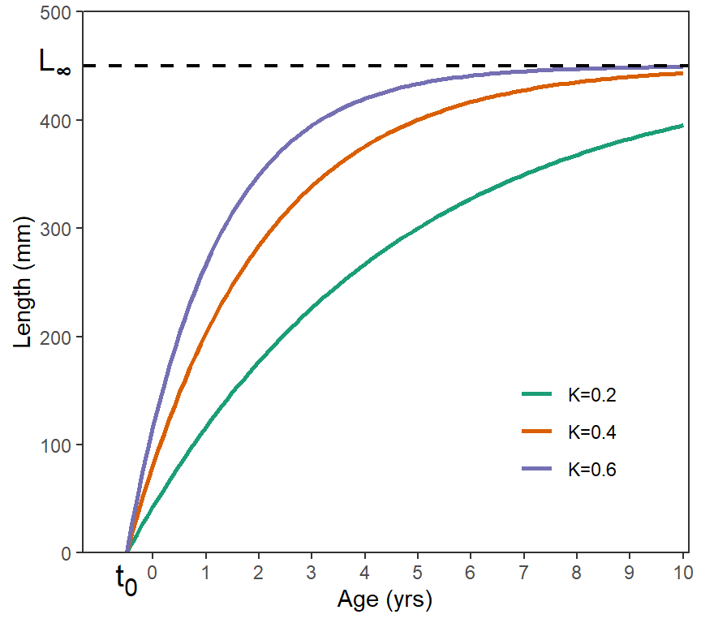
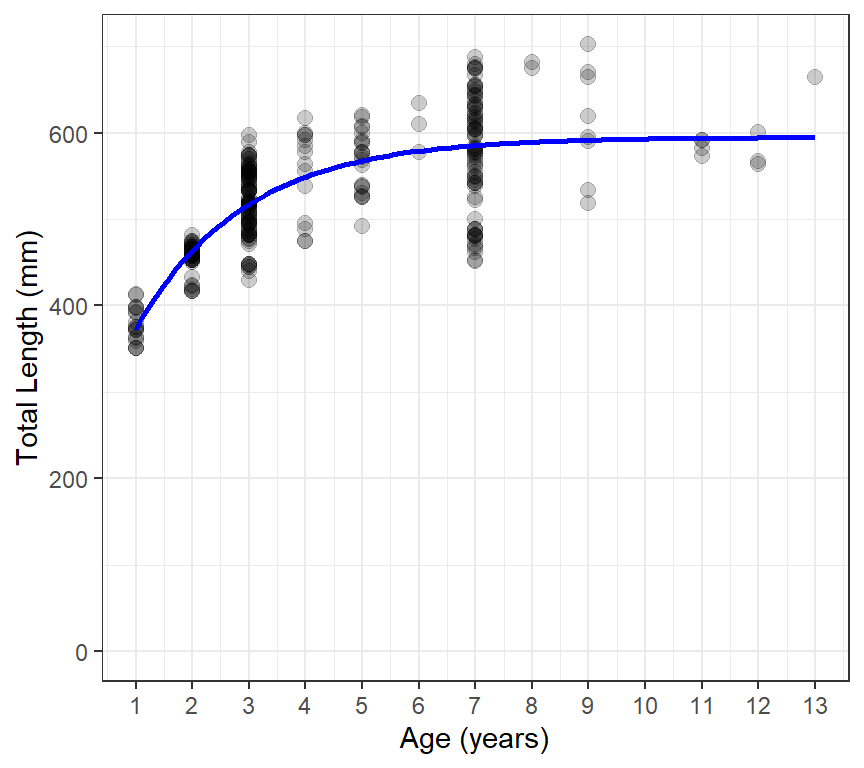

# Growth

> **Warning**
>
> This is a work-in-progress.

## Introduction

Fish growth, defined as the change in body size (either length or
weight) over time, is critically important in the management of fish
populations. For example, fish in populations that exhibit fast growth
may be managed with higher length limits, whereas those where growth is
slow (i.e., the fish are stunted) may warrant a relaxation of length
limits in an attempt to decrease the size of the population to limit
intraspecific competition in hopes of increasing growth. Thus,
understanding fish growth is an important component of simulating
management actions with the yield-per-recruit (YPR) and dynamic pool
(DPM) models implemented in `rFAMS`.

Fish growth is modeled in `rFAMS` as the change in length over time, as
indexed by age. Ultimately length will be used to estimate weight in the
yield models through the weight-length relationship discussed
[here](https://fishr-core-team.github.io/rFAMS/articles/MANUAL_WeightLength.html).
There are many functions available to model fsih growth, but only the
traditional von Bertalanffy function is used in the YPR and DPM models
in `rFAMS`.

The purpose of this article is to briefly describe the von Bertalanffy
growth function (VBGF), briefly show how to model growth with the VBGF
in `R`, and show how to extract the necessary growth-related parameters
for use in the YPR and DPM models in `rFAMS`.

The following packages are used in this article.

``` r
library(rFAMS)
library(FSA)
library(ggplot2)
```

## von Bertalanffy Growth Function

There are a larger number of functions that can be used to model fish
growth, including the VBGF, Gompertz, logistic, Schnute,
Schnute-Richards, and Richards functions.[^1] Of these, the VBGF is by
far the most common, though some have argued that it is not adequate or
appropriate for this purpose. Regardless, the VBGF has a long history of
use for modeling fish growth and has been implemented into many
synthetic models, including the YPR and DPM models implemented in
`rFAMS`.

Many versions of the VBGF, called parameterizations,[^2] are available.
These parameterizations, and the other growth models mentioned above,
are thoroughly reviewed in the “Growth Estimation” chapter of [this
book](https://fisheries.org/bookstore/all-titles/professional-and-trade/55078c/).
The most commonly used parameterization, and the one required by
`rFAMS`, is the “traditional” VBGF proposed by Beverton and Holt (1957);

\$\$ L_i=L\_\infty\large\[1-e^{-K(t_i-t_0)}\large\]+\epsilon_i
\qquad(1)\$\$

where $`L_i`$ and $`t_i`$ are the observed length and age of the $`i`$th
fish, $`L_\infty`$ is the asymptotic mean length, $`K`$ is the “Brody
growth coefficient” that describes how quickly the mean length
approaches $`L_\infty`$, and $`t_0`$ represents the theoretical age
where the mean length would be 0, and $`\epsilon_i`$ is an additive
“error” term that represents how the $`i`$th individual varies from the
model. The VBGF represents growth that is very quick (i.e., steeply
ascending) at young ages, slows (i.e., begins to flatten out) at middle
ages, and slows further as it approaches an asymptote at older ages
([Figure 1](#fig-VBex1)).



Figure 1: Three VBGF with $`L_\infty`$=450, $`t_0`$=-0.05, and three
values of $`K`$.

There are several aspects of the VBGF that are often confused. First,
the VBGF, as with most growth models, represents the average length at a
given age. In other words, individual fish would be points that would be
scattered around one of the VBGF lines shown in [Figure 1](#fig-VBex1).
One ramification of this is that $`L_\infty`$ is the asymptote for the
**mean** length, not individual lengths. Thus, $`L_\infty`$ is not an
esimate of the maximum length of individual fish but, rather, an
estimate of the maximum mean length of fish in the population. Second,
$`K`$, is the so-called “Brody growth coefficient” but it does not
represent growth in a true sense of the word. The units of $`K`$ are the
inverse of time (e.g., years⁻¹) rather than units of length divided by
units of time. $`K`$ does represent how fast the mean length-at-age
approaches $`L_\infty`$, with $`L_\infty`$ approached more quickly for
larger values of $`K`$ ([Figure 1](#fig-VBex1)). So, $`K`$ represents
the rate of growth but it is not an actual measure of any specific type
of growth rate. Third, $`t_0`$ is the x-intercept of the VBGF and a
modeling artifact that is required to “anchor” the left side of the VBGF
so that the VBGF best represents the available data (which is often not
extensive for young fish). One should not try to interpret a biological
meaning for $`t_0`$. Fourth, all three parameters of the VBGF are highly
correlated, which means that several combinations of $`L_\infty`$,
$`K`$, and $`t_0`$ may produce very similar VBGF trajectories.[^3]

The YPR and DPM models in `rFAMS` require estimates of $`L_\infty`$,
$`K`$, and $`t_0`$ to simulate yield from the fish population. Methods
for estimating these parameters from observed data are described in the
next section.

## Fitting von B in R

Finding values for the parameters that result in the “best-fit” of the
VBGF is more complicated than, for example, fitting a simple linear
regression. This complication is caused by having to use non-linear
model fitting methods that rely on algorithms that search for the
best-fit parameters (rather than having closed-form mathematical
equations that produce the best-fit values), the often “messy”
length-age data in many samples (e.g., few small fish, few old fish),
and the inherent variability in length-age data for many populations
(i.e., high variability in lengths of fish of the same age). Working
with and, at times handling, these issues is comprehensively discussed
in the “Growth Estimation” chapter of [this
book](https://fisheries.org/bookstore/all-titles/professional-and-trade/55078c/),
but will not be discussed further here.

The data required for modeling growth with the VBGF are the length (in
mm for `rFAMS`) and age (in whole number years for this model in
`rFAMS`) of individual fish at the time of capture. The length and age
of Walleye from Lake Erie are stored in `WalleyeErie2` in the `FSAdata`
package and will be used as an example here. These data are obtained and
the first few rows examined below. Note that lengths and ages are in
`tl` and `age`, respectively.[^4]

``` r
data(WalleyeErie2,package="FSAdata")
head(WalleyeErie2)
#>     setID loc grid year  tl   w  sex    mat age
#> 1 2003001   1  940 2003 360 460 male mature   2
#> 2 2003001   1  940 2003 371 571 male mature   2
#> 3 2003001   1  940 2003 375 507 male mature   2
#> 4 2003001   1  940 2003 375 584 male mature   2
#> 5 2003001   1  940 2003 375 537 male mature   2
#> 6 2003001   1  940 2003 376 553 male mature   2
```

For our purposes, fish from one location (i.e., 3) and year (i.e,. 2010)
will be isolated using
[`filter()`](https://dplyr.tidyverse.org/reference/filter.html) from
`dplyr`. These data are stored in the new data.frame `waeredux`.

``` r
waeredux <- WalleyeErie2 |>
  dplyr::filter(loc==3,year==2010)
```

The VBGF is a non-linear function that requires using non-linear
regression techniques to estimate model parameters that provide a
best-fit to data. Most non-linear regression equations use an algorithm
to efficiently search for these values through minimimizing an error
sum-of-squares or maximizing a likelihood. Most of these algorithms must
be provided with a starting point for their search.

The
[`findGrowthStarts()`](https://fishr-core-team.github.io/FSA/reference/findGrowthStarts.html)
function in `FSA` can be used to provide “good” starting values for many
growth functions, including the traditional VBGF. The
[`findGrowthStarts()`](https://fishr-core-team.github.io/FSA/reference/findGrowthStarts.html)
function requires a formula of the form `length~age` as the first
argument and a data.frame with those variables in `data=`. The function
defaults to using the traditional VBGF so no further arguments are
required. The result should be assigned to an object for further use
below.

``` r
gstrts <- FSA::findGrowthStarts(tl~age,data=waeredux)
gstrts   # starting values, not the best-fit values
#>       Linf          K         t0 
#> 623.252339   0.431295  -1.130975
```

Before continuing to the non-linear regression function in R, an R
function that contains the mathematical function to be used (i.e., the
VBGF) must be created. This can be done manually, but
[`makeGrowthFun()`](https://fishr-core-team.github.io/FSA/reference/makeGrowthFun.html)
from `FSA` can be used to more easily create many growth functions. No
arguments are required by
[`makeGrowthFun()`](https://fishr-core-team.github.io/FSA/reference/makeGrowthFun.html)
to construct an R function for the traditional VBGF, because the
traditional VBGF is the default for
[`makeGrowthFun()`](https://fishr-core-team.github.io/FSA/reference/makeGrowthFun.html).

``` r
vbfun <- FSA::makeGrowthFun()
vbfun
#> function (t, Linf, K = NULL, t0 = NULL) 
#> {
#>     if (length(Linf) == 3) {
#>         t0 <- Linf[[3]]
#>         K <- Linf[[2]]
#>         Linf <- Linf[[1]]
#>     }
#>     Linf * (1 - exp(-K * (t - t0)))
#> }
#> <bytecode: 0x0000013f92da8580>
#> <environment: namespace:FSA>
```

The code in this function looks complicated but the last line before the
`}` shows the right-hand-side of [Equation 1](#eq-VonB). Thus, this
function returns a mean length given the values of `t` (i.e., age),
`Linf`, `K`, and `t0` (as shown in the top line of the function).

``` r
vb1(3,Linf=450,K=0.4,t0=-0.5)    # mean length at age-3
#> [1] 339.0314
vb1(3:6,Linf=450,K=0.4,t0=-0.5)  # mean lengths at age-3 to age-6
#> [1] 339.0314 375.6155 400.1386 416.5769
```

The most common function used to perform non-linear regression in R is
[`nls()`](https://rdrr.io/r/stats/nls.html), which is provided with base
R. For this purpose, [`nls()`](https://rdrr.io/r/stats/nls.html)
requires a formula that has `length` on the left-hand-side and the
specific growth function (e.g., `vb1`) with the specific `age` variable
and model parameter names[^5] on the right-hand-side, the associated
data in `data=`, and the saved starting values in `start=`. The result
should be saved to an object.

``` r
resvb1 <- nls(tl~vbfun(age,Linf,K,t0),data=waeredux,start=gstrts)
```

Estimated values for the parameters are extracted from the saved
[`nls()`](https://rdrr.io/r/stats/nls.html) object with
[`coef()`](https://rdrr.io/r/stats/coef.html).

``` r
coef(resvb1)   # best-fit values
#>        Linf           K          t0 
#> 595.0451068   0.5233219  -0.8861433
```

As mentioned previously, growth modeling in general, but also in R, can
be much more involved then what is shown here. We recommend the “Growth
Estimation” chapter of [this
book](https://fisheries.org/bookstore/all-titles/professional-and-trade/55078c/)
as a comprehensive resource for modeling fish growth in R. However,
[this demonstration from
`FSA`](https://fishr-core-team.github.io/FSA/articles/Fitting_Growth_Functions.html)
and [several `fishR`
posts](https://fishr-core-team.github.io/fishR/blog/#category=Growth)
are also good resources for using R to model growth.

However, a quick method for using
[`ggplot()`](https://ggplot2.tidyverse.org/reference/ggplot.html) to
show the fitted VBGF against the observed data is shown below with the
result in [Figure 2](#fig-VBWAE).

``` r
ggplot(data=waeredux,aes(y=tl,x=age)) +
  geom_point(size=2.5,alpha=0.2) +
  scale_y_continuous(name="Total Length (mm)",limits=c(0,NA)) +
  scale_x_continuous(name="Age (years)",breaks=1:14) +
  stat_function(fun=vb1,args=list(Linf=coef(resvb1)),linewidth=1,color="blue") +
  theme_bw()
```



Figure 2: Total length versue age for Lake Erie Walleye with the
best-fit von Bertalanffy growth function superimposed in blue.

## Extracting Parameters for Use in `rFAMS`

Functions to perform the YPR and DPM modeling in `rFAMS` all take a list
or vector that contains seven required life history parameters in the
`lhparms=` argument[^6]. Three of those required life history parameters
are $`L_\infty`$, $`K`$, and $`t_0`$.

[`makeLH()`](https://fishr-core-team.github.io/rFAMS/reference/makeLH.md)
is a convenience function in `rFAMS` that takes user-provided values for
the seven life history parameters, performs adequacy checks on each,[^7]
and then puts the values into a properly formatted list (preferably) or
vector.[^8] In its simplest usage,
[`makeLH()`](https://fishr-core-team.github.io/rFAMS/reference/makeLH.md)
has seven required arguments, one for each of the required life history
parameters. Three of these arguments are `Linf=`, `K=` and `t0=` for the
three VBGF parameters estimated in the previous section.

``` r
LH <- makeLH(N0=100,tmax=15,Linf=595.0451068,K=0.5233219,t0=-0.8861433,
             LWalpha=-5.877308,LWbeta=3.341721)
LH
#> $N0
#> [1] 100
#> 
#> $tmax
#> [1] 15
#> 
#> $Linf
#> [1] 595.0451
#> 
#> $K
#> [1] 0.5233219
#> 
#> $t0
#> [1] -0.8861433
#> 
#> $LWalpha
#> [1] -5.877308
#> 
#> $LWbeta
#> [1] 3.341721
```

A less prone-to-error method for entering the VBGF parameters is to give
the object saved from [`nls()`](https://rdrr.io/r/stats/nls.html) in the
previous section to `Linf=` and not provide values to `K` and `t0`.
[`makeLH()`](https://fishr-core-team.github.io/rFAMS/reference/makeLH.md)
will extract the parameter estimates from the
[`nls()`](https://rdrr.io/r/stats/nls.html) object to put in the life
history parameter list.

``` r
LH <- makeLH(N0=100,tmax=15,Linf=resvb1,
             LWalpha=-5.877308,LWbeta=3.341721)
LH
#> $N0
#> [1] 100
#> 
#> $tmax
#> [1] 15
#> 
#> $Linf
#> [1] 595.0451
#> 
#> $K
#> [1] 0.5233219
#> 
#> $t0
#> [1] -0.8861433
#> 
#> $LWalpha
#> [1] -5.877308
#> 
#> $LWbeta
#> [1] 3.341721
```

[^1]: [See
    here](https://fishr-core-team.github.io/FSA/articles/Growth_Function_Parameterizations.html#von-bertalanffy)
    for discussion of these growth functions.

[^2]: [See
    here](https://fishr-core-team.github.io/FSA/articles/Growth_Function_Parameterizations.html)
    for discusion of VBGF parameterizations.

[^3]: This may make it difficult for algorithms to “find” the best set
    of VBGF parameters to represent observed data.

[^4]: More information about these data can be found in [the
    documentation](https://fishr-core-team.github.io/FSAdata/reference/WalleyeErie2.html)
    for `WalleyeErie2`.

[^5]: These will always be `Linf`, `K`, and `t0` if the traditional VBGF
    and
    [`makeGrowthFun()`](https://fishr-core-team.github.io/FSA/reference/makeGrowthFun.html)
    are used.

[^6]: See
    [here](https://fishr-core-team.github.io/rFAMS/reference/yprBH_MinLL.html)
    and
    [here](https://fishr-core-team.github.io/rFAMS/reference/dpmBH_MinLL.html),
    for example

[^7]: For example, is it numeric or is it \>0 (if appropriate).

[^8]: See [`makeLH()`
    documentation](https://fishr-core-team.github.io/rFAMS/reference/makeLH.html)
    for more details.
