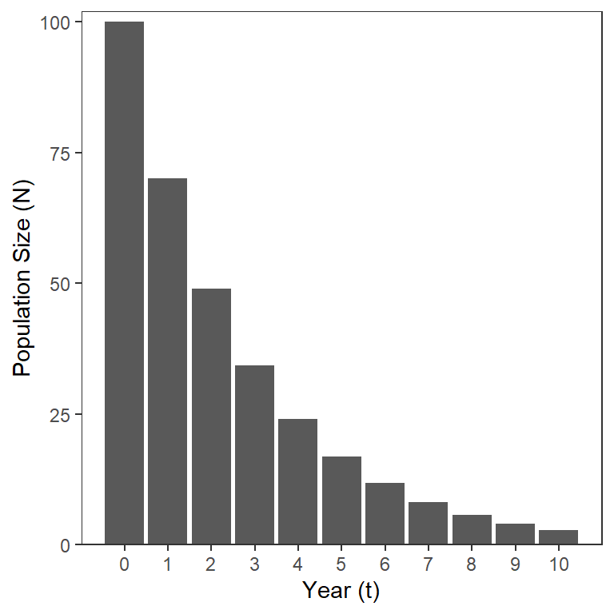
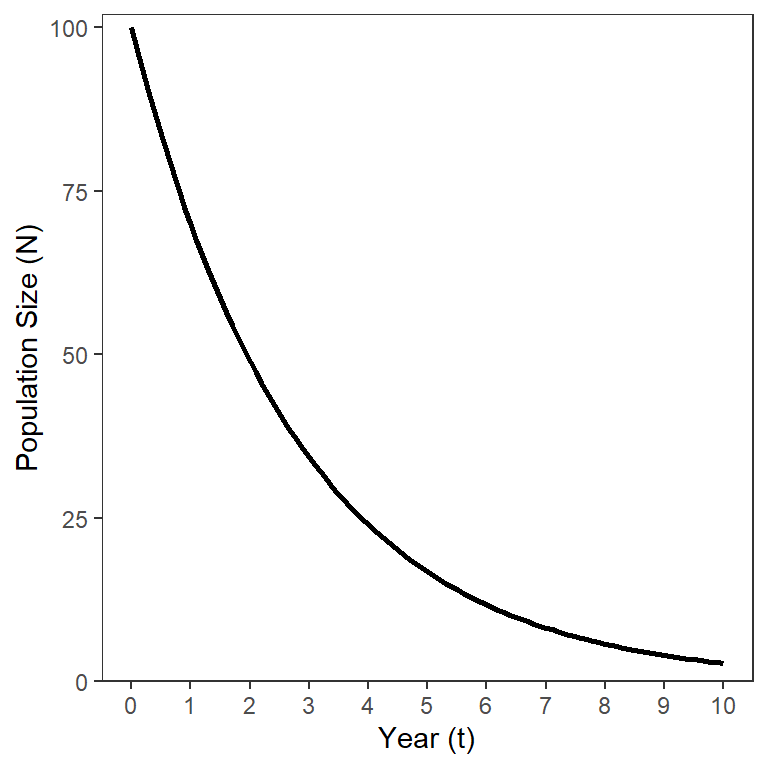
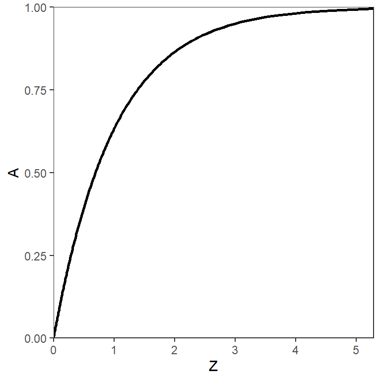
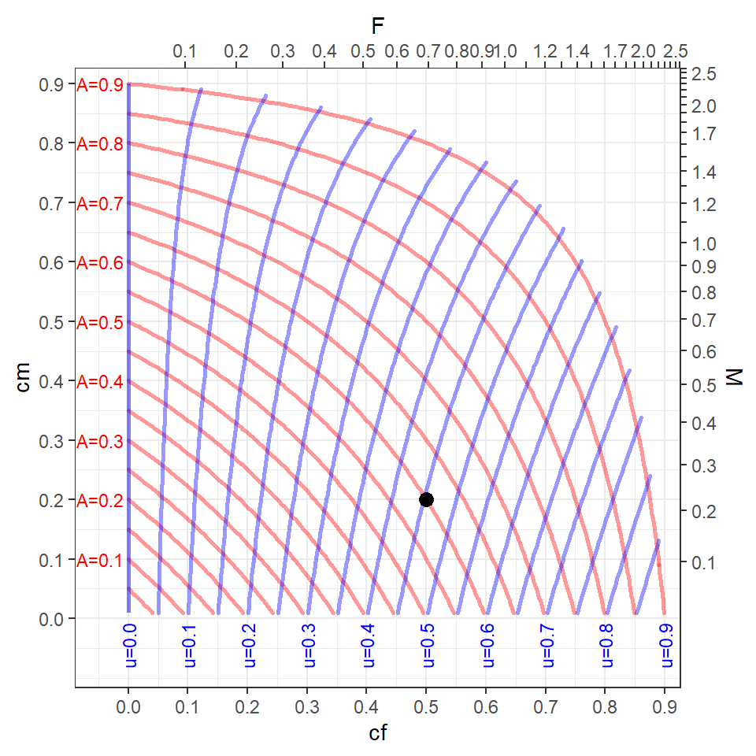
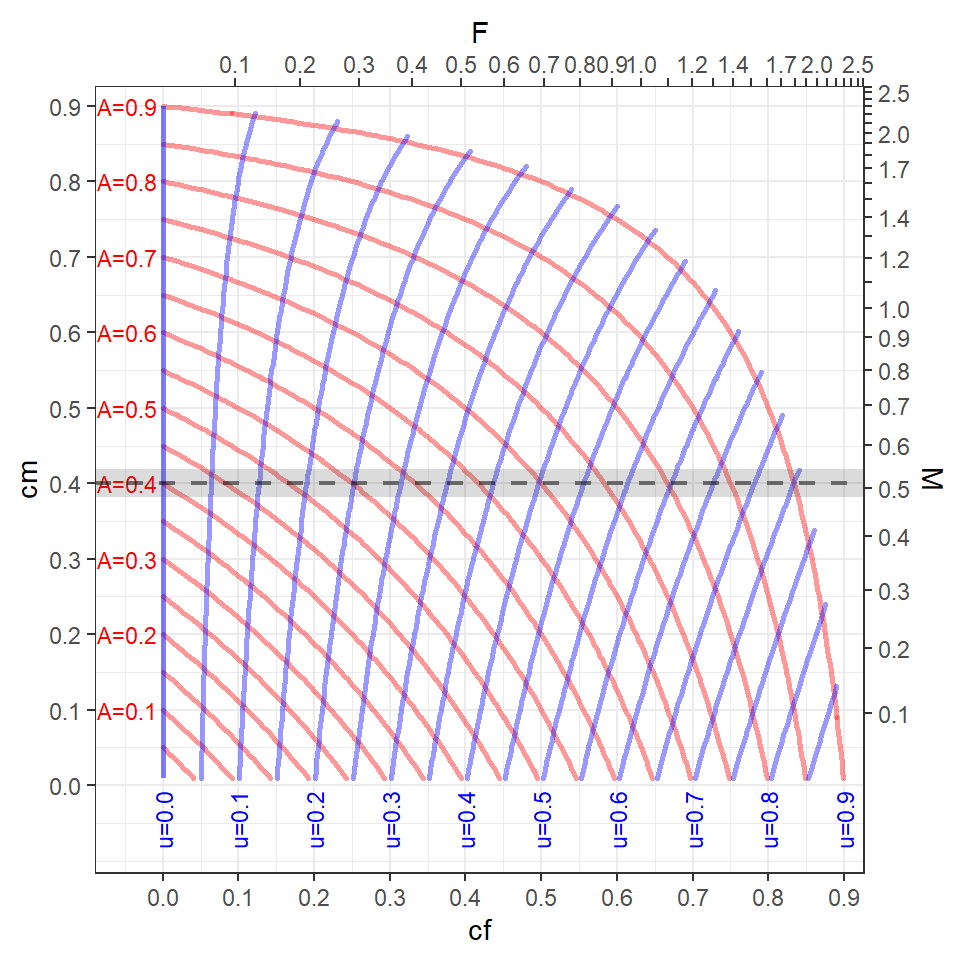
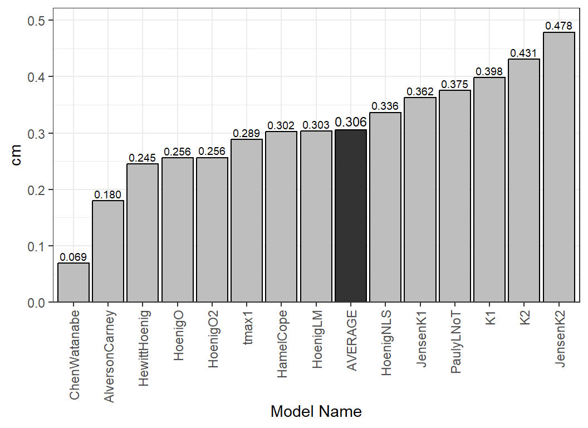

# Mortality

> **Warning**
>
> This is a work-in-progress.

## Introduction

Fish within a given population die, either due to fishing (i.e., harvest
or extraction, but may also include catch-and-release mortality) or due
to reasons not related to fishing. Mortality due to the act of fishing
is called *fishing mortality*, whereas mortality due to all other
sources is traditionally called *natural mortality*. The combination of
these two sources is referred to as *total mortality*. Rates of these
types of mortality may be computed on different scales, resulting in
estimates with different (or no) meanings, interpretations, and symbols.
Understanding these different estimates, and their relationships, can be
confusing, especially when working within yield-per-recruit (YPR) and
dynamic pool (DP) models. Herein, we explain the more common rates used
in fisheries, how they are implemented in `rFAMS`, and how they may be
estimated for use in `rFAMS`.

The following packages are used in this article.

``` r
library(rFAMS)
library(ggplot2)
```

## Definitions

### Fisheries Types

Ricker (1975) defined two types of fisheries with respect to estimating
rates of mortality. A *Type-1* fishery is when mortality due to fishing
occurs separately from mortality due to other natural causes. This type
of fishery occurs most often when the open harvest season is very short,
likely days or only a few weeks. When modeling a Type-1 fishery it is
customary to “start” the annual period when fish mortality begins so
that fishing mortality occurs before natural mortality during the
modeled annual period. A *Type-2* fishery is when mortality due to
fishing and other natural causes occur together. This type of fishery
occurs when the open harvest season is prolonged, often occupying much
of the annual period. These definitions are generally approximations to
most real fisheries. However, Type-2 fisheries are common in many (but
not all) recreational sport fisheries.

Some mortality rates are computed differently depending on whether a
Type-1 or Type-2 fishery is a better approximation of reality. These
differences will be described where appropriate in the next section.

> **Definitions to Remember**
>
> - **Type-1 Fishery** – the occurrence of fishing mortality occurs
>   separately from natural mortality (i.e., don’t occur at same time).
> - **Type-2 Fishery** – the occurrence of fishing and natural mortality
>   overlap (i.e., occur at same time).

### Mortality Rates

The simplest form of mortality to understand is *annual total mortality
rate*, which is commonly symbolized with $`A`$. Annual total mortality
is the proportion of a population present at the beginning of an annual
period (e.g., year) that dies before the start of the next annual
period, regardless of the source of that death. If the size of the
population ($`N`$) is known at the beginning of two successive
periods,[^1] then $`A`$ is the difference between those values (i.e.,
number of deaths) divided by the value at the beginning of the annual
period; i.e.,

``` math
 A = \frac{\text{Number of Deaths in Period}}{\text{Number Alive at Start of Period}} = \frac{N_{t}-N_{t+1}}{N_{t}} = 1-\frac{N_{t+1}}{N_{t}}  \qquad(1)
```

where $`N_{t}`$ is the population size at time $`t`$.[^2]

Closely related to $`A`$ is $`S`$, the *annual total survival rate* or
the proportion of a population present at the beginning of an annual
period that survives to the start of the next annual period; i.e.,

``` math
 S = \frac{\text{Number Alive at Start of Next Period}}{\text{Number Alive at Start of Period}} = \frac{N_{t+1}}{N_{t}} \qquad(2)
```

Individuals can only either survive or die during the annual period so
$`S+A=1`$, which, by rearrangement, means $`A=1-S`$ and $`S=1-A`$.

The annual rates expressed by $`A`$ and $`S`$ are easy to interpret. For
example, an $`A`$ of 0.30 means that 30% of the population alive at the
start of the annual period was dead by the end of the annual period. Of
course, if $`A`$ is 0.30 then $`S`$ is 0.7 which meams that 70% of the
population alive at the start of the annual period survived to the start
of the next annual period.

[Equation 2](#eq-S) can be rearranged to solve for $`N_{t+1}`$ and then,
by substituting subsequent solutions over annual time steps, a formula
for the population size at annual steps of time $`t`$ is obtained,[^3]

``` math
N_t = N_0S^t = N_0(1-A)^t \qquad(3)
```

The model in [Equation 3](#eq-discrete_pop) shows that the number in a
cohort (i.e., same group) that starts with $`N_0`$ individuals will
decline exponentially over time ([Figure 1](#fig-discrete_pop)).



Figure 1: Population size (n) by year (t) in the discrete population
model starting with 100 individuals assuming A=0.3.

As stated above, $`A`$ is easy to interpret. Unfortunately though, $`A`$
cannot (generally) be separated into the two component sources of
fishing and natural mortality. The reason for this difficulty is that
these two sources of mortality *compete* with each other over the course
of the annual period. In other words, a fish that is caught (i.e.,
suffered fishing mortality) early in the annual period is not
“available” to die of natural causes later in that annual period (and
vice versa).

The continuous analog to the discrete population model in
[Equation 3](#eq-discrete_pop) is

``` math
 N_t = N_0e^{-Zt}  \qquad(4)
```

which is derived from integrating the model where the negative rate of
change (i.e., decline) of the size of the population over time is
proportional to the size of the population at that time

``` math
 \frac{dN}{dt} = -ZN 
```

where $`Z`$ is the *instantaneous total mortality rate.* This model also
shows an exponential, but continuous, decline in $`N`$ over time
([Figure 2](#fig-continuous_pop)).



Figure 2: Population size (n) by year (t) in the continuous population
model starting with 100 individuals assuming Z=0.357.

Unfortunately, $`Z`$ is not directly interpretable; i.e., the values
don’t directly relate to any easily described characteristic of the size
of the population. However, $`Z`$ is directly related to $`A`$ by

``` math
 A=1-e^{-Z}  \qquad(5)
```

as can be seen by comparing [Equation 3](#eq-discrete_pop) and
[Equation 4](#eq-continuous_pop) and then simplifying. The relationship
between $`A`$ and $`Z`$ is logarithmic ([Figure 3](#fig-AcompZ)).
Further note that $`A`$ is between 0 and 1 (i.e., it is a proportion),
whereas $`Z`$ is only positive (i.e., between 0 and $`\infty`$).



Figure 3: Logarithmic relationship between total annual mortality rate
(A) and total instantaneous moretality rate (Z).

The annual total mortality rate ($`A`$) is directly related to other
mortality parameters that will be defined further below; i.e.,

``` math
 A = u+v = cf+cm-cf\times cm  \qquad(6)
```

Why would one use the uninterpretable $`Z`$ when it can be converted to
the interpretable $`A`$? The main value of the continuous population
model is that in any given “instant” of time fish can only die from one
source of mortality. Thus, fishing and natural mortality do not
“compete” in these “instants.” This results in fishing and natural
mortality summing to total mortality on the continuous (or
instantaneous) scale. Thus,

``` math
Z=M+F \qquad(7)
```

where $`M`$ is the *instantaneous natural mortality rate* and $`F`$ is
the *instantaneous fishing mortality rate*.

As with $`Z`$, $`M`$ and $`F`$ are not interpretable. As shown in
[Equation 5](#eq-ZtoA), $`Z`$ can be directly converted to $`A`$.
Similar calculations can be performed with $`F`$ and $`M`$, but care
must be taken to carefully interpret the result.

The *conditional natural mortality rate* ($`cm`$) is calculated from
$`M`$ with

``` math
 cm=1-e^{-M}  \qquad(8)
```

and represents the annual natural mortality rate **if** fishing
mortality did not exist. This definition may make more sense by
considering the following two things. First, as with the conversion from
$`Z`$ to $`A`$, $`1-e^{-X}`$ is the process for converting instantaneous
rates ($`Z`$ and $`M`$) to annual rates ($`A`$ and $`cm`$). Second,
$`M`$ is computed for a theoretical “instant” where only natural, and
not fishing, mortality occurred. Thus, this conversion calculation acts
as if *only* natural mortality happens in all of the “instants” that are
converted to the annual rate.

Similarly, *conditional fishing mortality rate* is computed from $`F`$
with

``` math
 cf=1-e^{-F}  \qquad(9)
```

and represents the annual fishing mortality rate **if** natural
mortality did not exist.

All mortality rates discussed thusfar – $`cm`$, $`cf`$, $`A`$, $`Z`$,
$`M`$, and $`F`$ – are computed the same way regardless of whether one
is considering a Type-1 or Type-2 fishery. The annual expectations of
death due to fishing (i.e., the exploitation rate) and the expectation
of natural death are two more measures of mortality to be considered,
but how they are calculated depends on the type of fishery.

The *annual exploitation rate* ($`u`$) is the proportion of the
population alive at the start of the annual period that died due to
fishing (i.e., harvest, but may include catch-and-release mortality).
Similarly, the *expectation of natural death* ($`v`$) is the proportion
of the population alive at the start of the annual period that died due
to causes other than fishing. In a Type-1 fishery $`u`$ is the same a
$`cf`$ and $`v`$ is $`cm(1-u)`$ or $`cm(1-cf)`$.

Ricker (1975) showed that, for a Type-2 fishery, the instantaneous and
annual rates are proportional such that the ratio of “fishing to total
mortality” is the same on the annual and instantaneous scales; i.e.,

``` math
 \frac{Z}{A} = \frac{F}{u} 
```

This can be rearranged to show that

``` math
 u = \frac{F}{Z}A  \qquad(10)
```

Thus, the annual exploitation rate is the portion of the annual total
mortality rate ($`A`$) that is due to fishing or the proportion of the
population alive at the start of the annual period that died due to
fishing. For example, suppose that $`F`$=0.5 and $`M`$=0.7 such that[^4]
$`Z`$=0.5+0.7=1.2 and[^5] $`A=1-e^{-\text{1.2}}`$=0.70. Thus, 70% of
this population of fish died during the annual period. Now,[^6]
$`u=\frac{\text{0.5}}{\text{1.2}}`$ 0.70=0.29. Thus, 29% of this
population of fish died due to fishing during the annual period.

The same proportionality holds for natural mortality; i.e.,

``` math
 \frac{Z}{A} = \frac{M}{v} 
```

Thus,

``` math
 v = \frac{M}{Z}A  \qquad(11)
```

With arguments similar to those for $`u`$, the annual expectation of
death is the proportion of the population alive at the start of the
annual period that died due to causes other than fishing.

> **Definitions to Remember**
>
> - **Annual total mortality rate** ($`A`$) – proportion of fish alive
>   at the beginning of annual period that are not alive at the end of
>   the annual period.
> - **Annual total survival rate** ($`S`$) – proportion of fish alive at
>   the beginning of annual period that are still alive at the end of
>   the annual period.
> - **Conditional annual natural mortality rate** ($`cm`$) – proportion
>   of fish alive at the beginning of an annual period that are not
>   alive at the end of the annual period due to non-fishing reasons
>   *assuming* no fishing-related mortality occurred.
> - **Conditional annual fishing mortality rate** ($`cf`$) – proportion
>   of fish alive at the beginning of an annual period that are not
>   alive at the end of the annual period due to fishing *assuming* no
>   natural mortality occurred.
> - **Annual exploitation rate** ($`u`$) – proportion of fish alive at
>   the beginning of the annual period that died during the annual
>   period due to fishing (i.e., harvest).
> - **Annual expectation of natural death** ($`v`$) – proportion of fish
>   alive at the beginning of the annual period that died during the
>   annual period due to causes other than fishing.
> - **Instantaneous total mortality rate** (*Z*) – *no interpretable
>   definition*.
> - **Instantaneous natural mortality rate** (*M*) – *no interpretable
>   definition*.
> - **Instantaneous fishing mortality rate** (*F*) – *no interpretable
>   definition*.

Methods for estimating these rates are discussed in the
[Estimation](#estimation) section below. Relationships between these
rates are discussed next.

## Relationships

The YPR and DP functions in `rFAMS` require the user to articulate
values for `cf` and `cm` but those models generally use `F`, `M`, `Z`,
`A`, and `S` in their calculations and, in our experience, most users
examine the model results relative to `u` (or `cf`). Thus, it is
important to understand each of the rates discussed in the previous
section and how they are related to each other. The relatoinships
discussed in this section will be for a Type-2 fishery, as that is the
most prevalent type of fishery used in `rFAMS`.

[Figure 4](#fig-Mortality_relationships) helps demonstrate these
relationships from the position of choosing values of $`cf`$ and $`cm`$,
as is done in `rFAMS`. Some things to consider when examining this plot.

- The tickmarks and labels on the top and bottom axes of this plot show
  how $`cf`$ and $`F`$ are related (though [Equation 9](#eq-cf)). For
  example, $`cf`$=0.5 is approximately equal to $`F`$=0.7 (which can be
  confirmed by inverting [Equation 9](#eq-cf) such that
  -log(1-0.5)=0.69).
- Similarly, the tickmarks and labels on the left and right axes show
  how $`cm`$ and $`M`$ are related (through [Equation 8](#eq-cm)).
- The curving red lines are “contours” of equal values of $`A`$, which
  are labelled to the left of every-other contour. For example, if
  `cf`=0.5 and `cm`=0.2, then $`A`$ is approximately 0.6 (which can be
  confirmed with 0.5+0.2-0.5x0.2 from [Equation 6](#eq-Acfcm)).[^7]
- The curving blue lines are “contours” of equal values of $`u`$, which
  are labelled at the bottom of every-other contour. For example, if
  `cf`=0.5 and `cm`=0.2 then $`u`$ is approximately 0.45 (which can be
  confirmed from [Equation 10](#eq-exploitation) and approximate values
  with
  $`\frac{\text{0.7}}{\text{0.7}+\text{0.23}}\text{0.6}`$=0.45).[^8]



Figure 4: Relationships between conditional fishing ($`cf`$),
conditional natural ($`cm`$), instantaneous fishing ($`F`$),
instantaneous natural ($`M`$), and annual total ($`A`$) mortality rates
and exploitation rate($`u`$). The black dot represents one point used as
an example in the main text.

It should be noted that the “data” required to make
[Figure 4](#fig-Mortality_relationships) was truncated to include only
values of $`A \leq 0.9`$ because, while not impossible, it would be rare
to have more than 90% of the fish die in an annual period. Under this
assumption, values of $`cf`$ and $`cm`$ that are in the upper-right
corner of [Figure 4](#fig-Mortality_relationships) result in values of
$`A`$ that are largely unrealistic. One should consider this in
situations where multiple combinations of $`cf`$ and $`cm`$ are modeled.

In our experience, it is common for users to model YPR or DPM across a
variety of values of $`cf`$, which are generally under the control of
the fisheries manager, at a constant value (or a few constant values) of
$`cm`$, which generally is not under the control of the fisheries
manager. For example, consider the situation with $`cm=0.4`$ and values
of $`cf`$ that range from 0.1 to 0.9 in steps of 0.1 (gray horizontal
line in [Figure 5](#fig-Mortality_Ex1)). Visually this suggests that
$`A`$ will be modeled from 0.4 to well above 0.9 and $`u`$ will be
modeled from 0 to $`\approx`$ 0.8. If the user wants to restrict the
modeling exercise to more realistic values of $`A`$, say less than 0.8,
then they may want to only model $`cf`$ from 0 to $`\approx`$ 0.65. This
would, however, restrict the range of modeled $`u`$ to be from 0 to
$`\approx`$ 0.55.



Figure 5: Same as [Figure 4](#fig-Mortality_relationships) but with a
reference line at a constant $`cm`$=0.4.

## Estimation

### Total Mortality

Methods for estimating $`Z`$ (and thus $`A`$) using catch-at-age data
(i.e., catch curves) are [described
here](https://fishr-core-team.github.io/FSA/articles/Mortality.html)
using functions in the `FSA` package.

### Natural Mortality

A thorough review of methods to estimate $`M`$ is
[here](https://www.researchgate.net/publication/363889470_A_review_of_estimation_methods_for_natural_mortality_and_their_performance_in_the_context_of_fishery_stock_assessment).
One method described therein exploits the generally high correlation
between $`M`$ and various life history or abiotic factors to develop
simple models for predicting $`M`$ from these other factors. Many of the
models described therein were also thoroughly reviewed
[here](https://www.researchgate.net/publication/264936317_Evaluating_the_predictive_performance_of_empirical_estimators_of_natural_mortality_rate_using_information_on_over_200_fish_species)
with clear recommendations for their use (or not).

Many of these models for estimating $`M`$ from life history or abiotic
factors are available in
[`metaM()`](https://fishr-core-team.github.io/FSA/reference/metaM.html)
of `FSA`. The list of potential methods that can be used and some
specifics about the methods, including which life history or abiotic
parameters are required for the method, are in the [`metaM()`
documentation](https://fishr-core-team.github.io/FSA/reference/metaM.html#details).

The
[`est_natmort()`](https://fishr-core-team.github.io/rFAMS/reference/est_natmort.md)
function in `rFAMS` performs these same calculations but is designed to
work more efficiently with inputs typical to other `rFAMS` functions.
For example, the main YPR and DP models in `rFAMS` take a list of life
history parameters as an input. This list is best created with
[`makeLH()`](https://fishr-core-team.github.io/rFAMS/reference/makeLH.md)
from `rFAMS`.[^9]

``` r
lhex <- makeLH(N0=100,tmax=15,Linf=500,K=0.3,t0=-0.5,LWalpha=-5.613,LWbeta=3.1)
```

If this list is the first argument to
[`est_natmort()`](https://fishr-core-team.github.io/rFAMS/reference/est_natmort.md)
then the necessary life history parameters will be extracted for use in
models to estimate $`cm`$ (and $`M`$).[^10]

``` r
est_natmort(lhex)
#>            method          M         cm                  givens
#> 1       HoenigNLS 0.41002265 0.33636478                 tmax=15
#> 2         HoenigO 0.29543534 0.25579246                 tmax=15
#> 3        HoenigO2 0.29631969 0.25645032                 tmax=15
#> 4        HoenigLM 0.36126963 0.30320890                 tmax=15
#> 5    HewittHoenig 0.28133333 0.24522330                 tmax=15
#> 6           tmax1 0.34060000 0.28865661                 tmax=15
#> 7       PaulyLNoT 0.47024562 0.37515122          K=0.3, Linf=50
#> 8              K1 0.50760000 0.39806150                   K=0.3
#> 9              K2 0.56300000 0.43050200                   K=0.3
#> 10      HamelCope 0.36000000 0.30232367                 tmax=15
#> 11       JensenK1 0.45000000 0.36237185                   K=0.3
#> 12       JensenK2 0.65100000 0.47847601                   K=0.3
#> 13 AlversonCarney 0.19872105 0.18022146          tmax=15, K=0.3
#> 14   ChenWatanabe 0.07181977 0.06930138 tmax=15, K=0.3, t0=-0.5
```

Users of `rFAMS` will most often use these estimates to get an idea of
`cm` values to use in the YPR and DP modeling. This may be aided by
including the average `cm` (and `M`) to the bottom of the output with
`incl.avg=TRUE`.

``` r
est_natmort(lhex,incl.avg=TRUE)
#>            method          M         cm                  givens
#> 1       HoenigNLS 0.41002265 0.33636478                 tmax=15
#> 2         HoenigO 0.29543534 0.25579246                 tmax=15
#> 3        HoenigO2 0.29631969 0.25645032                 tmax=15
#> 4        HoenigLM 0.36126963 0.30320890                 tmax=15
#> 5    HewittHoenig 0.28133333 0.24522330                 tmax=15
#> 6           tmax1 0.34060000 0.28865661                 tmax=15
#> 7       PaulyLNoT 0.47024562 0.37515122          K=0.3, Linf=50
#> 8              K1 0.50760000 0.39806150                   K=0.3
#> 9              K2 0.56300000 0.43050200                   K=0.3
#> 10      HamelCope 0.36000000 0.30232367                 tmax=15
#> 11       JensenK1 0.45000000 0.36237185                   K=0.3
#> 12       JensenK2 0.65100000 0.47847601                   K=0.3
#> 13 AlversonCarney 0.19872105 0.18022146          tmax=15, K=0.3
#> 14   ChenWatanabe 0.07181977 0.06930138 tmax=15, K=0.3, t0=-0.5
#> 15        AVERAGE 0.37552622 0.30586468
```

If desired, the average `cm` can be isolated by assigning the
[`est_natmort()`](https://fishr-core-team.github.io/rFAMS/reference/est_natmort.md)
result to an object and then selecting the last item in the `cm`
variable.

``` r
res <- est_natmort(lhex,incl.avg=TRUE)
avg_cm <- res$cm[nrow(res)]
avg_cm
#> [1] 0.3058647
```

Individual or sets of models can be chosen with `method=`. For example,
using only the `HamelCope` model is illustrated below.

``` r
est_natmort(lhex,method="HamelCope")
#>      method    M        cm  givens
#> 1 HamelCope 0.36 0.3023237 tmax=15
```

The names of available models along with their required life history or
abiotic inputs and citations are in the [documentation for
`metaM()`](https://fishr-core-team.github.io/FSA/reference/metaM.html#details)
from `FSA`.

Multiple models can be used by including the method names in a vector.

``` r
est_natmort(lhex,method=c("HamelCope","HoenigNLS"))
#>      method         M        cm  givens
#> 1 HamelCope 0.3600000 0.3023237 tmax=15
#> 2 HoenigNLS 0.4100226 0.3363648 tmax=15
```

Some models require inputs that are not contained in the life history
list and, thus, need to be explicitly defined within
[`est_natmort()`](https://fishr-core-team.github.io/rFAMS/reference/est_natmort.md).
For example, the `"QuinnDeriso"` model requires an estimate of the
proportion of individuals that survive to the maximum age to be given in
`PS=`.[^11]

``` r
est_natmort(lhex,method="QuinnDeriso",PS=0.02)
#>        method         M        cm           givens
#> 1 QuinnDeriso 0.2608015 0.2295662 PS=0.02, tmax=15
```

This same calculation can be made without giving the life history list
as long as all of the required inputs are specifically declared.

``` r
est_natmort(method="QuinnDeriso",tmax=15,PS=0.02)
#>        method         M        cm           givens
#> 1 QuinnDeriso 0.2608015 0.2295662 PS=0.02, tmax=15
```

Some common methods have been grouped together such that all methods in
the group may be chosen by giving the “group name” as the first argument
to
[`est_natmort()`](https://fishr-core-team.github.io/rFAMS/reference/est_natmort.md).[^12]
For example, the methods used in the original FAMS software are in a
group called `"FAMS"`. Some of these methods use inputs that are not in
the life history list and must then be specifically declared in
[`est_natmort()`](https://fishr-core-team.github.io/rFAMS/reference/est_natmort.md).

``` r
est_natmort(lhex,method="rFAMS",PS=0.02,Winf=5000,Temp=9,incl.avg=TRUE)
#>            method          M         cm                  givens
#> 1       HoenigNLS 0.41002265 0.33636478                 tmax=15
#> 2         HoenigO 0.29543534 0.25579246                 tmax=15
#> 3        HoenigO2 0.29631969 0.25645032                 tmax=15
#> 4        HoenigLM 0.36126963 0.30320890                 tmax=15
#> 5    HewittHoenig 0.28133333 0.24522330                 tmax=15
#> 6           tmax1 0.34060000 0.28865661                 tmax=15
#> 7       PaulyLNoT 0.47024562 0.37515122          K=0.3, Linf=50
#> 8              K1 0.50760000 0.39806150                   K=0.3
#> 9              K2 0.56300000 0.43050200                   K=0.3
#> 10      HamelCope 0.36000000 0.30232367                 tmax=15
#> 11       JensenK1 0.45000000 0.36237185                   K=0.3
#> 12       JensenK2 0.65100000 0.47847601                   K=0.3
#> 13 AlversonCarney 0.19872105 0.18022146          tmax=15, K=0.3
#> 14   ChenWatanabe 0.07181977 0.06930138 tmax=15, K=0.3, t0=-0.5
#> 15        AVERAGE 0.37552622 0.30586468
```

Finally, [Figure 6](#fig-metaMex) illustrates how one might examine
multiple estimates of $`cm`$ with the mean highlighted.[^13]

``` r
res <- est_natmort(lhex,incl.avg=TRUE)

ggplot(data=res,mapping=aes(x=reorder(method,cm),y=cm)) +
  geom_bar(mapping=aes(fill=method=="AVERAGE"),
           stat="identity",color="black") +
  geom_text(mapping=aes(label=formatC(cm,format="f",digits=3),
                        size=method=="AVERAGE"),vjust=-0.35) +
  scale_y_continuous(expand=expansion(mult=c(0,0.09))) +
  scale_x_discrete(name="Model Name") +
  scale_fill_manual(values=c("TRUE"="gray20","FALSE"="gray")) +
  scale_size_manual(values=c("TRUE"=3,"FALSE"=2.5)) +
  theme_bw() +
  theme(axis.text.x=element_text(angle=90,vjust=0.5,hjust=1),
        legend.position="none")
```



Figure 6: Multiple estimates of $`cm`$ with the mean of all estimates
highlighted.

### Fishing Mortality

> **Note**
>
> To be completed.

[^1]: In practice, catches of fish can be used instead if those catches
    are proportional to the size of the population.

[^2]: And, thus, $`N_{t+1}`$ is the population size one annual period
    later.

[^3]: This is the finite/discrete population model found in many ecology
    books.

[^4]: From [Equation 7](#eq-Zpartition)

[^5]: From [Equation 5](#eq-ZtoA)

[^6]: From [Equation 10](#eq-exploitation)

[^7]: Visually follow the red line what intersects the black point up to
    the “A=” label.

[^8]: Visually follow the blue line what intersects the black point down
    to the “u=” label.

[^9]: See the [documentation for
    `makeLH()`](https://fishr-core-team.github.io/rFAMS/reference/makeLH.html)
    for more specifics.

[^10]: Here the default set of models is used as no other arguments are
    given.

[^11]: This requirement is noted in the [documentation for
    `metaM()`](https://fishr-core-team.github.io/FSA/reference/metaM.html#details).

[^12]: See the [documentation for
    `metaM()`](https://fishr-core-team.github.io/FSA/reference/metaM.html#details)
    for a list of group names.

[^13]: See [this
    article](https://fishr-core-team.github.io/rFAMS/articles/ggplot_for_rFAMS.html)
    for help with using `ggplot2` to make graphs.
