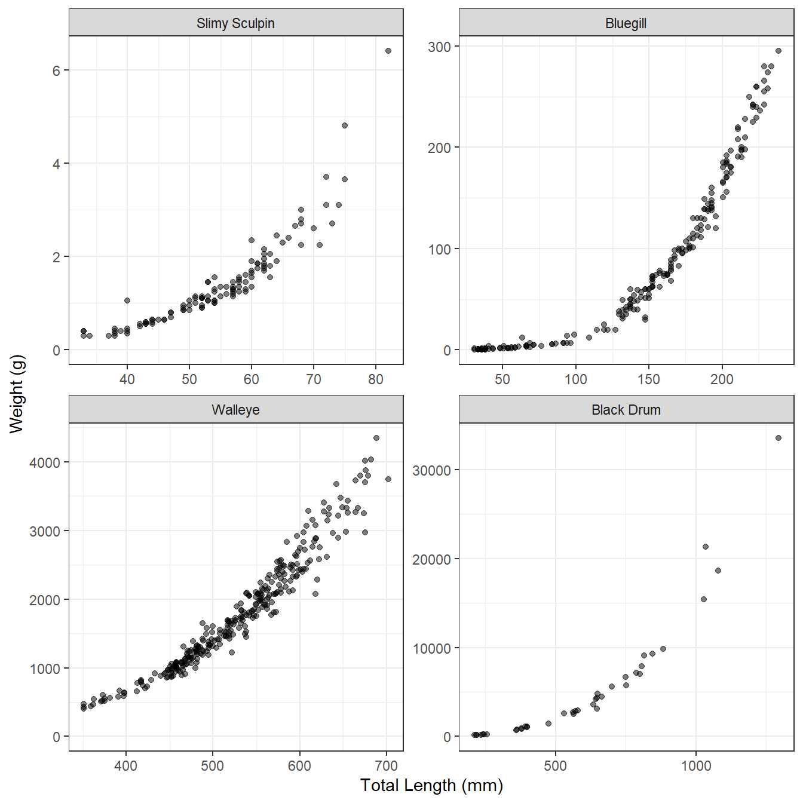
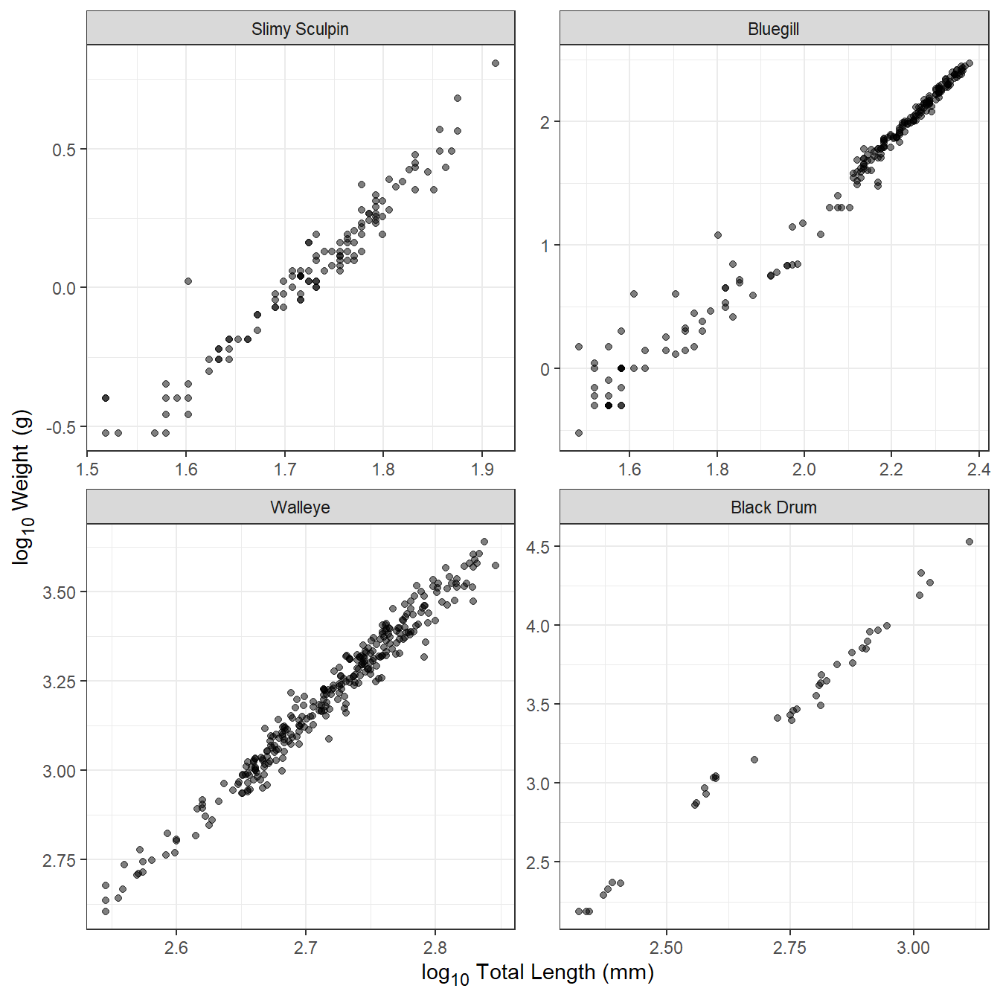
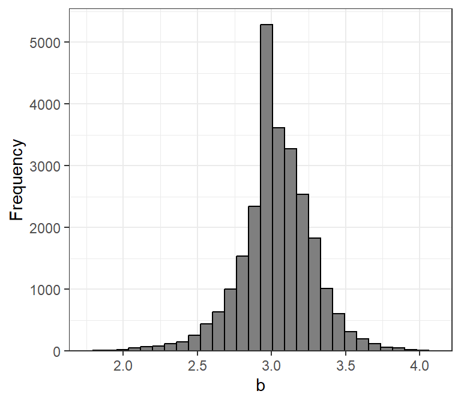
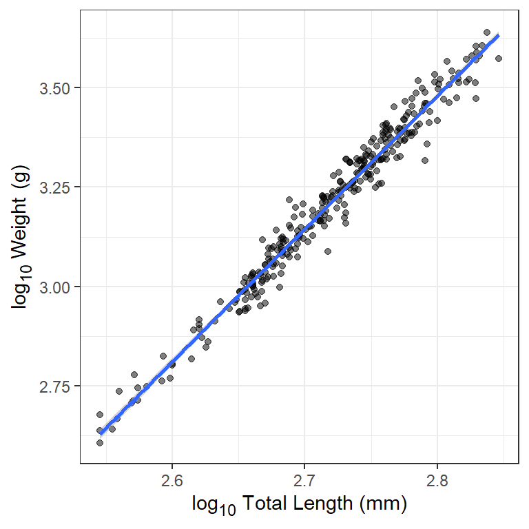

# Weight-Length

> **Warning**
>
> This is a work-in-progress.

## Introduction

The primary response or dependent variable calculated within the
yield-per-recruit (YPR) and dynamic pool (DPM) models implemented in
`rFAMS` is yield. *Yield* is the amount of fish harvested from a fishery
over a specified period of time and is usually, as is done in `rFAMS`,
expressed in units of weight or biomass (e.g., g, kg, tons). As such,
the YPR and DPM models need a mechanism to model weight of individual or
“average” fish. This is accomplished through the *weight-length
relationship*. The purpose of this article is to briefly describe the
typical characteristics of weight-length relationships for fish, briefly
show how to model a weight-length relationship in `R`, and show how to
extract the necessary weight-length relationship parameters for use in
the YPR and DPM models in `rFAMS`.

The following packages are used in this article.

``` r
library(rFAMS)
library(ggplot2)
library(ggtext)   # for element_markdown()
```

## Weight-Length Relationship

The required data for examining the weight-length relationship for a
sample of fish is measurements of the weight and length of individual
fish at the time of capture. **In `rFAMS`, weight is assumed to be
recorded in g and length in mm.** Other data may be recorded as well
(e.g., year of capture, area of capture, sex), but these other variables
are not be considered in this article.

The relationship between fish weight and length tends to have two
important characteristics, as illustrated for several disparate species
in [Figure 1](#fig-WL_4species). First, the relationship is not linear.
The degree of non-linearity may be impacted by the range of lengths
observed, with narrower ranges appearing more linear (e.g., compare
Walleye to Bluegill in [Figure 1](#fig-WL_4species)). This non-linearity
appears as length is inherently a one-dimensional meausure whereas
weight is more akin to the three-dimensional measure of volume. Second,
the variability in weight at a given length increases as the length of
the fish increases (i.e., the vertical scatter of the points increases
from left-to-right in [Figure 1](#fig-WL_4species)). Some of this
difference is due to scale (i.e., less room for variability at smaller
values of length), but some is also due to the natural increase in
variability among fish over time (e.g., due to differences in foot
intake and energy expenditures).



Figure 1: Weight-length relationship for four disparate species.

These characteristics of weight-length data suggest that a two-parameter
power function (to capture the curvature) with a multiplicative error
term (to capture the increase in variance) should be used to model the
weight-length relationship. Specifically, the model typically used with
fish is

``` math
 W_i=aL_i^b\epsilon_i  \qquad(1)
```

where $`W_i`$ and $`L_i`$ are the observed weight and length of the
$`i`$th individual, $`a`$ and $`b`$ are constants to be estimated (i.e.,
model parameters), and $`\epsilon_i`$ is the multiplicative error term
for the $`i`$th fish. The weight-length model in [Equation 1](#eq-WLraw)
can be transformed to a linear model by taking the logarithms of both
sides and simplifying; i.e.,

\$\$
log\_{10}\large(W_i\large)=log\_{10}(a)+blog\_{10}\large(L_i\large)+log\_{10}\large(\epsilon_i\large)
\qquad(2)\$\$

Any base of logarithms will work, but **`rFAMS` assumes that common logs
($`log_{10}`$) are used**.

With this transformation, [Equation 2](#eq-WLtrans) is a linear function
with \$y=log\_{10}\large(W_i\large)\$, \$x=log\_{10}\large(L_i\large)\$,
slope=$`b`$, and y-intercept=$`log_{10}(a)`$. In addition, the
individual errors (i.e., \$log\_{10}\large(\epsilon_i\large)\$) in
[Equation 2](#eq-WLtrans) are additive rather than multiplicative, such
that the variability in \$log\_{10}\large(W_i\large)\$ at a given
\$log\_{10}\large(L_i\large)\$ is constant for all
\$log\_{10}\large(W_i\large)\$. Thus, the log-log transformation for
weight and length data tends to produce a relationship that is linear
with a constant variability, as illustrated in
[Figure 2](#fig-logWL_4species) for the same four disparate species.



Figure 2: Log10-transformed weight-length relationship for four
disparate species.

Transformed weight-length data tend to be very strongly correlated, with
$`r^2`$ values often in excess of 0.95. Individual fish that are clearly
“off” the linear relationship evident for the rest of the sample often
have measurements that are in error. For example, the Slimy Sculpin in
[Figure 2](#fig-logWL_4species) at a log length of ~1.6 and log weight
of ~0 very likely has a length measurement that is too low or a weight
that is too high. Another common problem with smaller individuals of
some species is that weight may have been taken with an instrument that
lacked suitable precision for small individuals. This will appear in
transformed weight-length plots as higher variability in log weight at
lower log length values. This is apparent for Bluegill in
[Figure 2](#fig-logWL_4species). Individuals that are in error should
either be corrected or removed from further analysis, and individuals
for which the weight was measured imprecisely may also be removed.

The exponent parameter ($`b`$) of the weight-length relationship
averages to approximately 3 across many, many species of fish
([Figure 3](#fig-LWb)). For most fish, $`b`$ is between 2.5 and 3.5 and
values of $`b`$ less than 2.0 or greater than 4.0 should be reconsidered
as suspect. It will be shown below how `rFAMS` uses $`b`$, but take note
here that `rFAMS` will issue a warning if you attempt to use values of
$`b`$ outside the range of 2 to 4.



Figure 3: Histogram of $`b`$ values from weight-length relationships for
all relationships in the `rfishbase` database.

## Modeling Weight-Length in R

The advantage of log-log transforming weight-length data is that typical
simple linear regression tools can be used to model the relationship. In
this section, we show how to use `R` to model this linear relationship.
This description assumes that you are familiar with the basic principles
of simple linear regression.

The weight and length of Walleye from Lake Erie stored in `WalleyeErie2`
in the `FSAdata` package will be used as an example. These data are
obtained and the first few rows examined below. Note that weights and
lengths are in `w` and `tl`, respectively.[^1]

``` r
data(WalleyeErie2,package="FSAdata")
head(WalleyeErie2)
#>     setID loc grid year  tl   w  sex    mat age
#> 1 2003001   1  940 2003 360 460 male mature   2
#> 2 2003001   1  940 2003 371 571 male mature   2
#> 3 2003001   1  940 2003 375 507 male mature   2
#> 4 2003001   1  940 2003 375 584 male mature   2
#> 5 2003001   1  940 2003 375 537 male mature   2
#> 6 2003001   1  940 2003 376 553 male mature   2
```

For our purposes, fish from one location (i.e., 3) and year (i.e,. 2010)
will be isolated using
[`filter()`](https://dplyr.tidyverse.org/reference/filter.html) from
`dplyr`.[^2] These data are stored in the new data.frame `waeredux`.

``` r
waeredux <- WalleyeErie2 |>
  dplyr::filter(loc==3,year==2010)
```

Transformed versions of the weight and length variables are added to the
data.frame with
[`mutate()`](https://dplyr.tidyverse.org/reference/mutate.html) from
`dplyr`. Note that [`log10()`](https://rdrr.io/r/base/Log.html) computes
common (i.e., base 10) logarithms.[^3]

``` r
waeredux <- waeredux |>
  dplyr::mutate(logw=log10(w),
                logtl=log10(tl))
head(waeredux)
#>     setID loc grid year  tl    w    sex    mat age     logw    logtl
#> 1 2010059   3 1288 2010 702 3746 female mature   9 3.573568 2.846337
#> 2 2010059   3 1288 2010 667 3325 female mature   7 3.521792 2.824126
#> 3 2010059   3 1288 2010 542 1765 female mature   3 3.246745 2.733999
#> 4 2010059   3 1288 2010 632 3143 female mature   7 3.497344 2.800717
#> 5 2010059   3 1288 2010 644 3216 female mature   7 3.507316 2.808886
#> 6 2010059   3 1288 2010 513 1467 female mature   3 3.166430 2.710117
```

A simple linear regression model is fit with
[`lm()`](https://rdrr.io/r/stats/lm.html) using a formula of the form
`Y~X` as the first argument and the corresponding data.frame in `data=`.
The result should be saved to an object for further analysis.

``` r
waelm <- lm(logw~logtl,data=waeredux)
```

The estimates of $`log_{10}(a)`$ and $`b`$ are extracted from the saved
[`lm()`](https://rdrr.io/r/stats/lm.html) object with
[`coef()`](https://rdrr.io/r/stats/coef.html). The estimate of
$`log_{10}(a)`$ is under `(Intercept)` and the estimates of $`b`$ is
under the name of the “X” variable (here `logtl`). Thus, the estimate of
$`log_{10}(a)`$ is -5.877308 and the estimate of $`b`$ is 3.341721.

``` r
coef(waelm)
#> (Intercept)       logtl 
#>   -5.877308    3.341721
```

Simple linear regression analyses may require further work than what is
shown here – such as assumption checking, assessing adequacy of fit,
testing significance. More detailed explanations of simple linear
regression should be consulted for these other aspects. However, it is
good practice to examine the fitted model relative to the observed data
([Figure 4](#fig-fitPlot)) to identify any gross problems with the data
or model fitting. Below demonstrates one way to do this with
`ggplot2`.[^4]

``` r
ggplot(data=waeredux,mapping=aes(x=logtl,y=logw)) +
  geom_point(alpha=0.5) +
  geom_smooth(method="lm") +
  scale_y_continuous(name="log~10~ Weight (g)") +
  scale_x_continuous(name="log~10~ Total Length (mm)") +
  theme_bw() +
  theme(axis.title.x=ggtext::element_markdown(),
        axis.title.y=ggtext::element_markdown())
```



Figure 4: Log10-transformed weight-length relationship for Walleye
captured at location 3 in Lake Erie in 2010. The best-fit linear model
is shown in blue.

## Extracting Parameters for Use in `rFAMS`

Functions to perform the YPR and DPM modeling in `rFAMS` all take a list
or vector that contains seven required life history parameters in the
`lhparms=` argument[^5]. Two of those required life history parameters
are $`log_{10}(a)`$ called `LWalpha` in `rFAMS` and $`b`$ called
`LWbeta` in `rFAMS`.

[`makeLH()`](https://fishr-core-team.github.io/rFAMS/reference/makeLH.md)
is a convenience function in `rFAMS` that takes user-provided values for
the seven life history parameters, performs adequacy checks on each,[^6]
and then puts the values into a properly formatted list (preferably) or
vector.[^7] In its simplest usage,
[`makeLH()`](https://fishr-core-team.github.io/rFAMS/reference/makeLH.md)
has seven required arguments, one for each of the required life history
parameters. Two of these arguments are `LWalpha=` and `LWbeta=` for the
two weight-length relationship parameters estimated in the previous
section.

``` r
LH <- makeLH(N0=100,tmax=15,Linf=500,K=0.3,t0=-0.5,
             LWalpha=-5.877308,LWbeta=3.341721)
LH
#> $N0
#> [1] 100
#> 
#> $tmax
#> [1] 15
#> 
#> $Linf
#> [1] 500
#> 
#> $K
#> [1] 0.3
#> 
#> $t0
#> [1] -0.5
#> 
#> $LWalpha
#> [1] -5.877308
#> 
#> $LWbeta
#> [1] 3.341721
```

A less prone-to-error method for entering the weight-length relationship
parameters is to give the object saved from
[`lm()`](https://rdrr.io/r/stats/lm.html) in the previous section to
`LWalpha=` and not provide a value to `LWbeta=`.
[`makeLH()`](https://fishr-core-team.github.io/rFAMS/reference/makeLH.md)
will extract the parameter estimates from the
[`lm()`](https://rdrr.io/r/stats/lm.html) object to put in the life
history parameter list.

``` r
LH <- makeLH(N0=100,tmax=15,Linf=500,K=0.3,t0=-0.5,
             LWalpha=waelm)
LH
#> $N0
#> [1] 100
#> 
#> $tmax
#> [1] 15
#> 
#> $Linf
#> [1] 500
#> 
#> $K
#> [1] 0.3
#> 
#> $t0
#> [1] -0.5
#> 
#> $LWalpha
#> [1] -5.877308
#> 
#> $LWbeta
#> [1] 3.341721
```

[^1]: More information about these data can be found in [the
    documentation](https://fishr-core-team.github.io/FSAdata/reference/WalleyeErie2.html)
    for `WalleyeErie2`.

[^2]: These are the “Walleye” data in fig-WL_4species.

[^3]: [`log()`](https://rdrr.io/r/base/Log.html) is used for natural
    (i.e., base $`e`$) logarithms.

[^4]: [Here](https://fishr-core-team.github.io/fishR/blog/posts/2023-3-31_Milleretal2022_Fig23/#recreating-figure-3)
    is an example for modifications to this simple plot.

[^5]: See
    [here](https://fishr-core-team.github.io/rFAMS/reference/yprBH_MinLL.html)
    and
    [here](https://fishr-core-team.github.io/rFAMS/reference/dpmBH_MinLL.html),
    for example

[^6]: For example, is it numeric or is it \>0 (if appropriate).

[^7]: See [`makeLH()`
    documentation](https://fishr-core-team.github.io/rFAMS/reference/makeLH.html)
    for more details.
