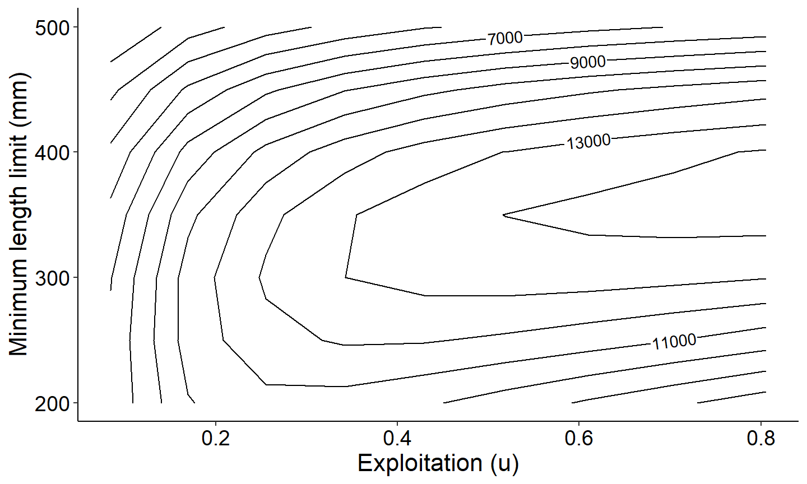
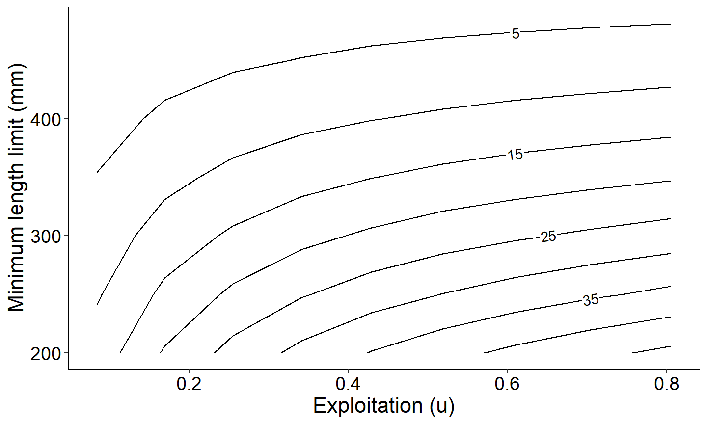

# Estimate yield based on multiple minimum length limits

``` r
library(rFAMS)
library(ggplot2)  ## to make figures
library(tidyr)    ## for pivot_longer
library(dplyr)    ## for filter
library(metR)     ## geom_text_contour
```

The objective of this article is to demonstrate how to use rFAMS to
calculate yield based on multiple minimum length limit with multiple
values of conditional fishing and conditional natural mortality.

## Build a life history parameter list

The first step for using any of the rFAMS simulation models is to create
an object with life history parameters using the
[`makeLH()`](https://fishr-core-team.github.io/rFAMS/reference/makeLH.md)
function. THe
[`makeLH()`](https://fishr-core-team.github.io/rFAMS/reference/makeLH.md)
function creates a list of the life history parameters needed.
Including, the initial number of recruits, maximum age of fish in your
population, von Bertalanffy growth model parameters ($`L_\infty`$,
$`K`$, and $`t_0`$), and parameters from the log10-transformed weight
length model (alpha and beta). By default, the
[`makeLH()`](https://fishr-core-team.github.io/rFAMS/reference/makeLH.md)
returns a list. These values can be generated from functions in the [FSA
package](https://fishr-core-team.github.io/FSA/index.html). The example
below uses the following life history parameters: - NO is the initial
number of recruits, set to 100. - tmax is the maximum age in the
population in years, set to 15. - Linf is the point estimate of
asymptotic mean length from the von Bertalanffy growth model, set to
592mm. - K (upper case) is the point estimate of the Brody growth
coefficient from the von Bertalanffy growth model, set to 0.20. - t0 is
the point estimate of the x-intercept (i.e., theoretical age at a mean
length of 0) from the von Bertalanffy growth model, set to -0.3. -
LWalpha is the point estimate of alpha from the length-weight regression
on the log10 scale, set to -5.528. - LWbeta is the point estimate of
beta from the length-weight regression on the log10 scale, set to 3.273.

``` r
# create life history parameter object
LH <- makeLH(N0=100,tmax=15,Linf=592,K=0.20,t0=-0.3,LWalpha=-5.528,LWbeta=3.273)
```

## Estimate yield for multiple minimum length limit and multiple conditional fishing and conditional natural mortality.

The function
[`yprBH_minLL_var()`](https://fishr-core-team.github.io/rFAMS/reference/yprBH_minLL_var.md)
function is used when yield is estimated with a single fixed minimum
length limit. This function requires the minimum length `minLL`;
specified range of conditional fishing mortality by setting the minimum
`cfmin`, maximum `cfmax`, and increment `cfinc`; specified range of
conditional natural mortality by setting the minimum `cmmin`, maximum
`cmmax`, and increment `cminc`; set any length of interest to monitor
`loi`; and the life history parameters `lhparams`.

rFAMS includes a function
[`est_natmort()`](https://fishr-core-team.github.io/rFAMS/reference/est_natmort.md)
to estimate instantaneous natural mortality (M) and conditional natural
mortality (cm) using parameters specified in the life history parameter
object. See the [FSA
package](https://fishr-core-team.github.io/FSA/index.html) for other
methods of calculating M and cm. To generate the range and average M and
cm using rFAMS:

``` r
est_natmort(LH, incl.avg = TRUE)
#>            method         M         cm                  givens
#> 1       HoenigNLS 0.4100226 0.33636478                 tmax=15
#> 2         HoenigO 0.2954353 0.25579246                 tmax=15
#> 3        HoenigOF 0.2793944 0.24375845                 tmax=15
#> 4        HoenigOM 0.3594796 0.30196053                 tmax=15
#> 5        HoenigOC 0.2409592 0.21412628                 tmax=15
#> 6        HoenigO2 0.2963197 0.25645032                 tmax=15
#> 7       HoenigO2F 0.2568301 0.22650034                 tmax=15
#> 8       HoenigO2M 0.3521442 0.29682129                 tmax=15
#> 9       HoenigO2C 0.3110774 0.26734282                 tmax=15
#> 10       HoenigLM 0.3612696 0.30320890                 tmax=15
#> 11   HewittHoenig 0.2813333 0.24522330                 tmax=15
#> 12          tmax1 0.3406000 0.28865661                 tmax=15
#> 13      PaulyLNoT 0.3308050 0.28165477        K=0.2, Linf=59.2
#> 14             K1 0.3384000 0.28708993                   K=0.2
#> 15             K2 0.4080000 0.33502112                   K=0.2
#> 16       JensenK1 0.3000000 0.25918178                   K=0.2
#> 17       JensenK2 0.5040000 0.39589062                   K=0.2
#> 18 AlversonCarney 0.2821182 0.24581544          tmax=15, K=0.2
#> 19   ChenWatanabe 0.1018740 0.09685666 tmax=15, K=0.2, t0=-0.3
#> 20        AVERAGE 0.3184244 0.27040613
```

Once you have decided the range of cf and cm and decided what minimum
length limit to consider, you can now proceed to estimating yield. The
following example uses the life history object created above with a
minimum length limit of 200mm, cf from 0.1 to 0.9 with increments of
0.1, cm from 0.1 to 0.9 with increments of 0.1, monitors lengths of 200,
250, 300, and 350mm.

``` r
Res_1 <- yprBH_minLL_var(lengthmin=200,lengthmax=500,lengthinc=50, #creates minimum length limits
                         cfmin=0.1,cfmax=0.9,cfinc=0.1, #creates vector of cf values
                         cmmin=0.1,cmmax=0.9,cminc=0.1, #creates vector of cm values
                         loi=c(400, 450, 500, 550),     #sets lengths of interest to monitor
                         lhparms=LH)                    #Specifies life history parameters
```

The output object will be a data.frame with the following calculated
values:

- yield is the estimated yield (in g).
- exploitation is the exploitation rate.
- Nharvest is the number of harvested fish.
- Ndie is the number of fish that die of natural deaths.
- Nt is the number of fish at time tr (time they become harvestable
  size).
- avgwt is the average weight of fish harvested.
- avglen is the average length of fish harvested.
- tr is the time for a fish to recruit to a minimum length limit (i.e.,
  time to enter fishery).
- F is the instantaneous rate of fishing mortality.
- M is the instantaneous rate of natural mortality.
- Z is the instantaneous rate of total mortality.
- S is the (total) annual rate of survival.
- N at xxx mm is the number that reach the length of interest supplied.
  There will be one column for each length of interest.

View the first few rows of the output

``` r
head(Res_1)
#>      yield     u Nharvest     Ndie     avgwt   avglen       Nt       tr
#> 1 40818.31 0.095 41.53181 41.53181  982.8204 401.1080 83.06361 1.761224
#> 2 42961.98 0.095 38.65116 38.65116 1111.5316 416.4771 77.30232 2.443479
#> 3 44833.10 0.095 35.56322 35.56322 1260.6592 432.8090 71.12644 3.233764
#> 4 45992.30 0.095 32.21300 32.21300 1427.7562 449.5853 64.42599 4.172845
#> 5 45715.51 0.095 28.51544 28.51544 1603.1847 465.7891 57.03087 5.330056
#> 6 42738.81 0.095 24.32552 24.32552 1756.9537 479.0075 48.65103 6.838398
#>           F         M        Z    S  cf  cm minLL  N0 Linf   K   t0 LWalpha
#> 1 0.1053605 0.1053605 0.210721 0.81 0.1 0.1   200 100  592 0.2 -0.3  -5.528
#> 2 0.1053605 0.1053605 0.210721 0.81 0.1 0.1   250 100  592 0.2 -0.3  -5.528
#> 3 0.1053605 0.1053605 0.210721 0.81 0.1 0.1   300 100  592 0.2 -0.3  -5.528
#> 4 0.1053605 0.1053605 0.210721 0.81 0.1 0.1   350 100  592 0.2 -0.3  -5.528
#> 5 0.1053605 0.1053605 0.210721 0.81 0.1 0.1   400 100  592 0.2 -0.3  -5.528
#> 6 0.1053605 0.1053605 0.210721 0.81 0.1 0.1   450 100  592 0.2 -0.3  -5.528
#>   LWbeta tmax notes N at 400 mm N at 450 mm N at 500 mm N at 550 mm
#> 1  3.273   15          39.15698    28.49531    18.03716    7.895417
#> 2  3.273   15          42.07533    30.61904    19.38146    8.483857
#> 3  3.273   15          45.72871    33.27768    21.06435    9.220507
#> 4  3.273   15          50.48460    36.73864    23.25508   10.179461
#> 5  3.273   15          57.03087    41.50249    26.27054   11.499418
#> 6  3.273   15          57.03087    48.65103    30.79548   13.480121
```

## Plot results

We will now create a series of figures to aid in interpreting the
output. First, a custom theme is created to use across all plots.

``` r
# Custom theme for plots (to make look nice)
theme_FAMS <- function(...) {
 theme_bw() +
 theme(
   panel.grid.major=element_blank(),panel.grid.minor=element_blank(),
   axis.text=element_text(size=14,color="black"),
   axis.title=element_text(size=16,color="black"),
   axis.title.y=element_text(angle=90),
   axis.line=element_line(color="black"),
   panel.border=element_blank()
 )
}
```

### Yield as a function of exploitation

The first graph will be a yield curve that displays the relationship
between yield as a function of exploitation for a specified conditional
natural morality `cm`. The example below uses `cm` = 0.30, which is
close to the estimated mean `cm` above of 0.27

``` r
# Round cm to account for "floating point arithmetic inaccuracies"
# will be fixed in next version of rFAMS so this isn't needed
Res_1$cm <- round(Res_1$cm,8)

# Extract results for cm=0.40 and minimum length limit=400
plot_dat <- Res_1 |> dplyr::filter(cm==0.30,minLL==400)

ggplot(data=plot_dat,mapping=aes(x=u,y=yield)) +
  geom_point() +
  geom_line() +
  labs(y="Total yield (g)",x="Exploitation (u)") +
  theme_FAMS()
```


This next graph plots yield curves as a function of exploitation with
multiple minimum lengths for a specified conditional natural morality
`cm`. The example below uses `cm` = 0.30, as above.

``` r
# Round cm to account for "floating point arithmetic inaccuracies"
# will be fixed in next version of rFAMS so this isn't needed
Res_1$cm <- round(Res_1$cm,8)

# Extract results for cm=0.40 and minimum length limit=400
plot_dat <- Res_1 |> dplyr::filter(cm==0.30)

ggplot(data=plot_dat,mapping=aes(y=yield,x=u,group=minLL,color=minLL)) +
  geom_line(linewidth=1) +
  scale_color_gradient2(high="black") +
  labs(y="Total yield (g)",x="Exploitation (u)",color="Min Length Limit") +
  theme_FAMS()
```


### Number of fish that reach a specified size as a function of exploitation

The next graph demonstrates how to explore the number of fish reaching a
specified length. This figure creates a plot showing the number of fish
reaching 450mm as a function of exploitation. Note this is based on a
conditional natural mortality `cm` of 0.30 which was filtered out in the
code block above.

``` r
# Extract results for cm=0.40 and minimum length limit=400
plot_dat <- Res_1 |> dplyr::filter(cm==0.30,minLL==400)

ggplot(data=plot_dat,mapping=aes(x=u,y=`N at 450 mm`)) +
  geom_point() +
  geom_line() +
  labs(y="Number of fish at 300 mm",x="Exploitation (u)") +
  theme_FAMS()
```


The next example graph plots the number of fish reaching all the lengths
of interests we monitored as a function of exploitation with conditional
natural mortality `cm` of 0.30 which was filtered out above.

``` r
# Select columns for plotting and convert to long
plot_data_long <- plot_dat %>%
 select(u,`N at 400 mm`, `N at 450 mm`, `N at 500 mm`, `N at 550 mm`) %>%
 pivot_longer(!u, names_to="loi",values_to="number")

# Generate plot
ggplot(data=plot_data_long,mapping=aes(x=u,y=number,group=loi,color=loi)) +
 geom_point() +
 scale_color_discrete(name="Yield",labels=c("N at 400 mm", "N at 450 mm", "N at 500 mm", "N at 550 mm"))+
 geom_line() +
 labs(y="Number of fish",x="Exploitation (u)") +
 theme_FAMS() +
 theme(legend.position = "top")+
 guides(color=guide_legend(title="Length of interest"))
```


### Isopleths of yield and number harvested

The final two graphs demonstrate how to construct isopleths using the
`ggplot2` and `metR` packages. We will use the same data from above that
is filtered for a conditional natural mortality `cm` of 0.30.

``` r
# Extract results for cm=0.40 and minimum length limit=400
plot_dat <- Res_1 |> dplyr::filter(cm==0.30)

# Yield isopleths for varying minLL and exploitation with cm=0.40
# Using same data as previous example
ggplot(data=plot_dat,mapping=aes(x=u,y=minLL,z=yield)) +
  geom_contour2(aes(label = after_stat(level))) +
  xlab("Exploitation (u)") +
  ylab("Minimum length limit (mm)") +
  theme_FAMS()
```



``` r

# Same isopleth as previous but using number harvested instead of yield
ggplot(data=plot_dat,mapping=aes(x=u,y=minLL,z=Nharvest)) +
  geom_contour2(aes(label = after_stat(level))) +
  xlab("Exploitation (u)")+
  ylab("Minimum length limit (mm)")+
  theme_FAMS()
```


